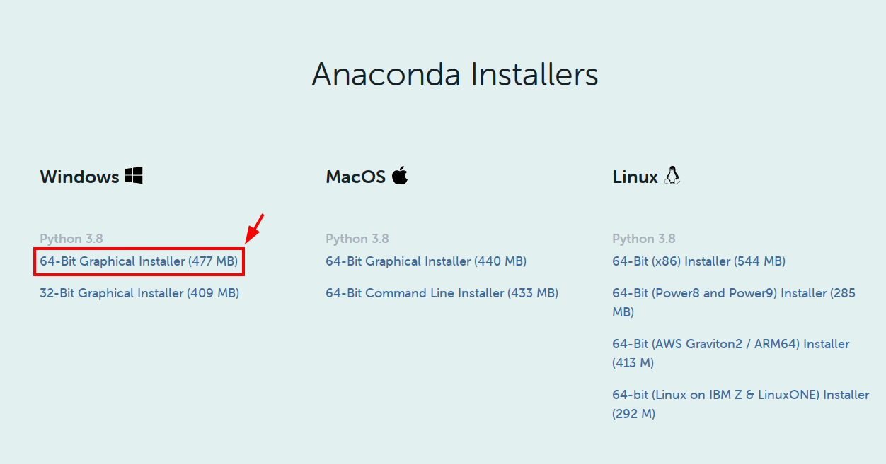
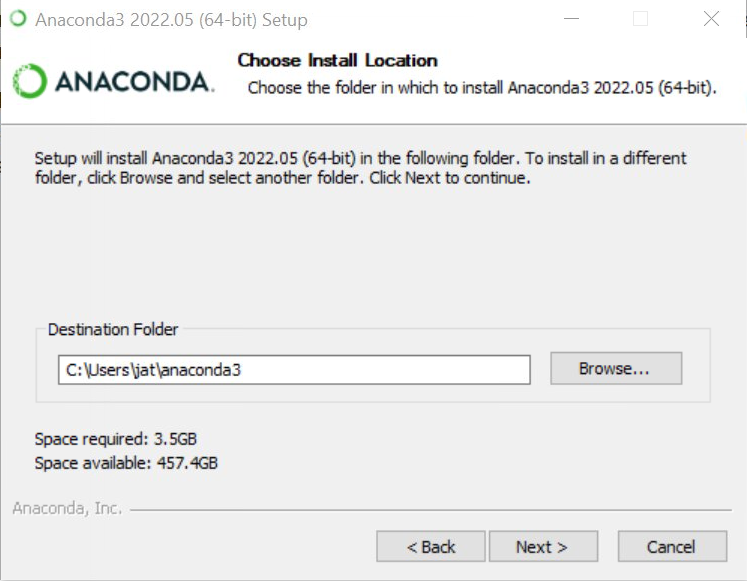
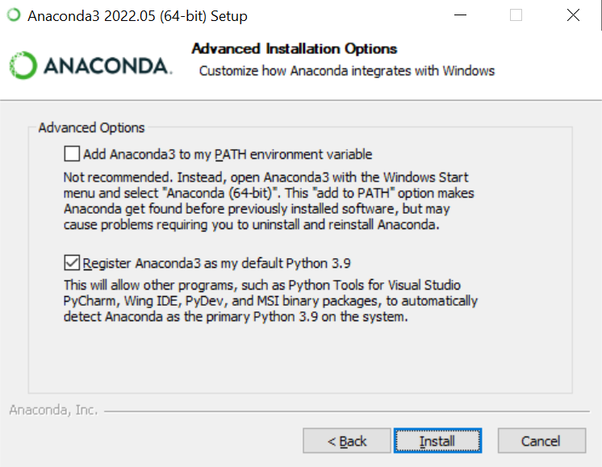
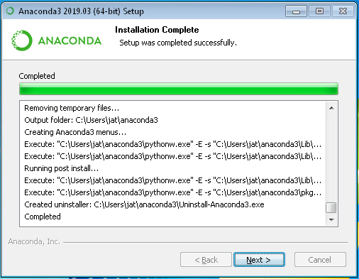
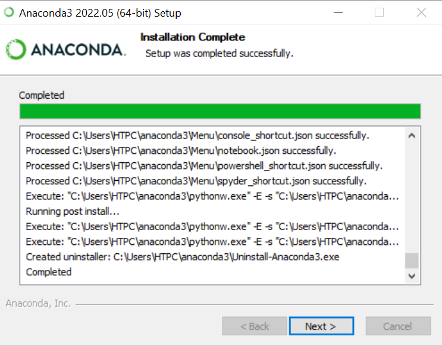

Installing via Anaconda
~~~~~~~~~~~~~~~~~~~~~~~

Installing HyperSpy with Anaconda is slightly more involved, but provides more
flexibility if you plan to do more development with Python, or need to run many
different Python programs on your machine alongside each other.

While it is mostly unattended, the download and installation of Anaconda can
take a fair amount of time (approximately 10 to 15 minutes, depending on the
speed of your system), so it is highly recommended to do this before you
arrive at the tutorial session (and when you have access to a decent internet
connection).

Download
^^^^^^^^

The installation process for Anaconda varies a bit depending on your operating
system. Instructions for Windows are detailed here. MacOS will be somewhat similar,
while if you run Linux, you will need to use the command line installer (an
exercise left to the reader). From the `Anaconda Python`_ link, click the
right download for your operating system:

   Make sure to select the 64-bit -- It's a rather large download, so a decent
   connection is recommended. Also make sure to choose Windows, macOS, or Linux
   depending on your system

..  _Anaconda Python: https://www.anaconda.com/products/individual#Downloads

Installing Anaconda
^^^^^^^^^^^^^^^^^^^

Detailed instructions for
`Windows <https://docs.anaconda.com/anaconda/install/windows/>`_,
`macOS <https://docs.anaconda.com/anaconda/install/mac-os/>`_, and
`Linux <https://docs.anaconda.com/anaconda/install/linux/>`_ are available on
the Anaconda website. Specific instructions for Windows are reproduced below.

Run the downloaded file to proceed with the installation. This process is fairly
straightforward. For the installation location, we *highly* recommend an easily
accessed path that does not require administrative rights, such as the folder
``anaconda3`` within your user directory:

   This path can be whatever you want (where you have write access), but
   a subfolder in the user directory is usually a convenient location - the
   default option is also fine

The next screen will present you with options about adding Anaconda to the
system ``PATH`` variable, and whether or not you want this installation to
be registered as the "default" Python installation on your system (via a
key saved to the registry on Windows). We recommend the default options (as
shown below), but if you have other Python installations on your system, you may
want to uncheck the "Register as default" option:

    Specifying configuration settings for the Anaconda installation on Windows

Click the "Install" button at this point, and go to get a coffee or tea (or go
for a walk), as the installation process takes some time depending on your disk
speed.

    The "Installation complete" screen after installing Anaconda on Windows

Once the installation completes, click the "Next" button to continue and then
"Finish" to exit the installer.

Usage
^^^^^

After Anaconda is installed, we suggest taking a look at the
"`Getting Started`_" guide from its documentation to familiarize yourself with
how Anaconda is used. There are a few ways to interact with Anaconda, primarily
through either the "navigator" application, or on the command line. One of the
most powerful features of Anaconda is the ``conda`` environment and package
manager, which allows you to create multiple different "installations" (known as
`environments`) of Python, enabling you to select which version of Python is
used for each environment and what packages are installed inside that
environment. A common setup is to have one environment for each project or
application you are working with. For this tutorial however, we will install
HyperSpy into the ``base`` (the default) environment (for ease of use) using
the command line.

..  _Getting Started: https://docs.anaconda.com/anaconda/user-guide/getting-started/

Installing HyperSpy with Anaconda
^^^^^^^^^^^^^^^^^^^^^^^^^^^^^^^^^

Like for Anaconda, detailed installation instructions for HyperSpy are
available directly from its `documentation <http://hyperspy.org/hyperspy-doc/current/user_guide/install.html#quick-instructions-to-install-hyperspy-using-anaconda-linux-macos-windows>`_.
The process will also be summarized here with a bit more instruction.

..  admonition:: Info about code blocks

    In the following section, lines in code blocks will be prefaced with ``$``
    or ``>>>``. ``$`` is used to indicate regular terminal input, while ``>>>``
    represents inputs to the Python interpreter (accessed by running ``python``
    from the regular command line. Any lines without these symbols
    indicate the expected output of the given command. To run the
    commands provided, copy everything after the ``$`` or ``>>>`` character into
    your terminal. Where necessary, commands will be given for both the Windows
    Anaconda prompt and the macOS/Linux terminal, so only use the commands
    specific to your operating system.

From the Start Menu (on Windows), open the *Anaconda Prompt*:

    Windows programs installed by Anaconda

On Mac or Linux, open a terminal as normal. If during installation you told
the installer to "initialize" Anaconda3, all the ``conda`` commands should
be immediately available. If not, you will have to run the following, replacing
the bracketed term with the actual path in which you installed Anaconda:

..  code-block:: bash

    $ source <ANACONDA_INSTALL_PATH>/bin/activate

before any of the ``conda`` commands will work. Again, `this is only for
Mac/Linux`, the commands should be available with no problem on Windows when
you launch the *Anaconda Prompt*.

From the prompt, run the following to install HyperSpy, its UI package, and its
dependencies:

..  code-block:: bash

    $ conda install -c conda-forge hyperspy hyperspyui kikuchipy atomap pyxem

After Anaconda calculates the dependencies (this may take quite a while,
please be patient) it will need to install, it will ask for confirmation to continue. 
Press ``Enter`` to accept the changes, and wait for the requested libraries to be
installed.

..  admonition:: Extension packages

    The "extension" libraries ``kikuchipy``, ``pyxem``, and ``atomap`` will be 
    installed using the command above. These are not absolutely necessary to install
    if you wish to just use HyperSpy on its own, but since these libraries will
    be covered in the short course, you will need to have them installed if you 
    wish to follow along interactively.

Testing the installation
^^^^^^^^^^^^^^^^^^^^^^^^
Once the install is completed, if you would like to test that your installation
is working properly, you can run a small test example by opening the
"Qt Console". From within the *Anaconda Prompt*, enter the following command
and then press ``Enter``:

..  code-block:: bash

    $ jupyter qtconsole

.. include:: testing_install.rst