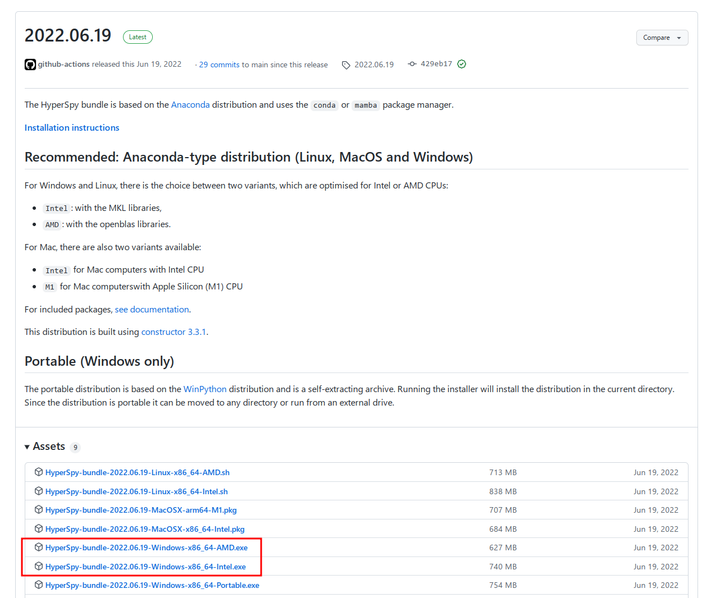
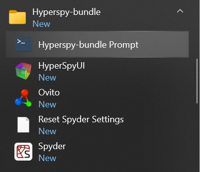

.. _bundle-label:

Installing via the "Bundle"
~~~~~~~~~~~~~~~~~~~~~~~~~~~

If you are brand new to Python, the easiest way to install HyperSpy is using
the "standalone" bundle package. This simple to install program provides a
customized Python installation that has the HyperSpy libraries pre-installed.
It is compatible with Windows, MacOS, or Linux, and is the recommended way
to install if you are not familiar with managing Python environments.
Instructions can be found in the HyperSpy Bundle's documentation
(`here <https://hyperspy.org/hyperspy-bundle/>`_), and an example of the 
installation process (for Windows) is provided below.

Download
^^^^^^^^

First, navigate to the repository home page
(https://github.com/hyperspy/hyperspy-bundle), and click on the download button
slightly down the page:

.. figure:: _static/bundle_install_button.png
   :width: 100 %
   :target: https://github.com/hyperspy/hyperspy-bundle
   :alt: Link to download the standalone HyperSpy bundle
   :figwidth: 70%

   Clicking the download button on the main repository page will bring you to
   the "Releases" page that contains a link to the installation files for each
   of the supported platform

On the releases page, click on the appropriate installer for your system. There
are a few options depending on the type of processor your computer has. 
For Windows or Linux, you should pick the "Intel" or "AMD" option depending on 
your type of CPU, since those versions are optimized for each type of processor. 
For Mac, you will need to choose either "Intel" (for older computers) or "M1" for
the newer "Apple Silicon" machines:

   Select one of either Intel or AMD depending on what type of processor is in
   your computer. If you use Linux or Mac, select the appropriate file for your
   system (although we only show a Windows installation here).

Installing
^^^^^^^^^^

After the download finishes, run the ``.exe`` file, accepting the default options.
Doing so will install HyperSpy into the folder you choose under a subfolder named
``hyperspy-bundle``. Depending on your system, the installation may take quite some 
time (especially on the "Setting up the package cache..." and 
"Setting up the base environment..." steps), but you should get a progress 
window that looks like:

.. figure:: _static/bundle_during_installation.png
   :width: 100 %
   :alt: Bundle installation progress
   :figwidth: 50%

   A screenshot during the bundle installation process

Once the installation eventually finishes, click the *Next* button, and then 
*Finish* to exit the installer. 

And that's it! You should now have a few new applications in your
Start Menu, including the "Miniforge Prompt" and "HyperSpyUI" (we won't be 
using the UI in this session, but you may play around with it if you're 
interested). You can either continue following the next section to test your
installation is working correctly, or continue to the
:ref:`getting-data` section on the main page.

Testing the installation
^^^^^^^^^^^^^^^^^^^^^^^^

If you would like to test that your installation is working properly, you can
run a small test example by opening the "Qt Console". This is an interactive
Python interpreter that allows you to type in Python statements directly. You
can start the Qt Console by using the "Hyperspy-bundle Prompt", which you will
find in the Start Menu:

   Launching the interactive "Hyperspy-bundle" Prompt from the Start Menu

Once the Hyperspy-bundle prompt opens, type ``jupyter qtconsole`` and press "Enter"
to launch the QT Console:

   Launching the QT console from the Miniforge prompt

.. include:: testing_install.rst