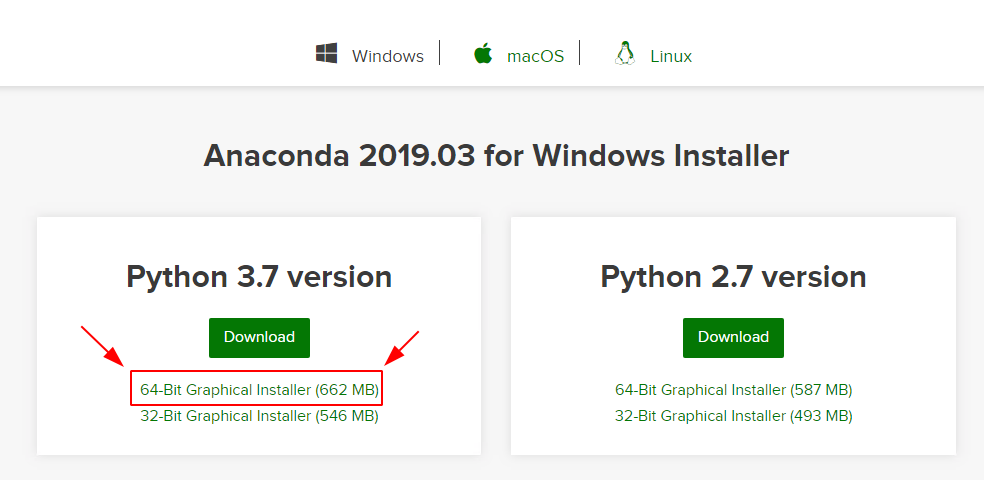
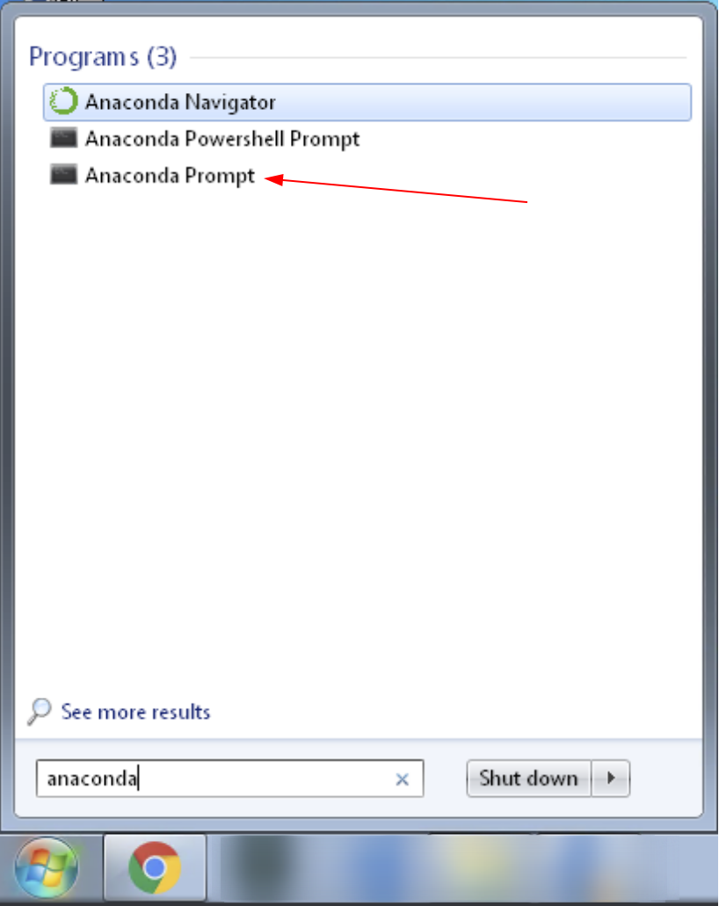
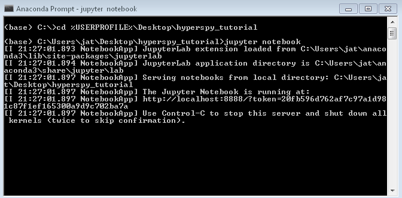

:tocdepth: 4

2019 NIST HyperSpy Tutorial
===========================

About the session
+++++++++++++++++

Thank you for registering for the NIST ODI-MMSD tutorial session on HyperSpy!
This informal tutorial session will introduce you to the capabilities of
HyperSpy in a casual and interactive environment, with plenty of time allocated
for questions and individual help. The goal for the session is that by the end
each attendee feels comfortable using HyperSpy for basic imaging and
hyperspectral data analysis, and knows where to look for further help,
if necessary.

There are a few useful links in the top header of this page. The first
(`Tutorial Repository <https://gitlab.nist.gov/gitlab/jat/hyperspy_tutorial>`_)
will take you to the git repository containing the notebooks and data we will
use during the tutorial. The next two point to the HyperSpy
`Homepage <http://hyperspy.org>`_ and
`User Guide <http://hyperspy.org/hyperspy-doc/current/user_guide/index.html>`_,
respectively. The homepage contains general information about the project as
a whole, while the User Guide is an extensive piece of documentation that tries
to explain how to use HyperSpy for all sorts of analyses. Feel free to refer
to these links before and during the tutorial session for additional help.

Event details
-------------

.. cssclass:: table-bordered

    +--------------------+-------------------------------------------------+
    | **Date:**          | Friday May 10, 2019                             |
    +--------------------+-------------------------------------------------+
    | **Time:**          | 8:30 AM - 12:30 PM ET                           |
    +--------------------+-------------------------------------------------+
    | **Location:**      | | *Gaithersburg*: Building 101 - Lecture Room C |
    |                    | | *Boulder*: Building 2 - Room 0113 (VTC)       |
    +--------------------+-------------------------------------------------+

About the instructors
---------------------

.. table::

    +---------+-----------------------------------------------------------------+
    | |josh|  | | |josh_link| is a research engineer within the Office          |
    |         |   of Data and Informatics (MML), and has an extensive           |
    |         |   background in materials science, microscopy, and data analysis|
    |         |   utilizing machine learning, artificial intelligence, and      |
    |         |   state-of-the art signal processing techniques to facilitate   |
    |         |   greater understanding of material systems. He is a (fairly)   |
    |         |   regular |contributor| to the upstream HyperSpy project and has|
    |         |   been a user of the software for over 5 years.                 |
    +---------+-----------------------------------------------------------------+
    | |andy|  | | |andy_link| is a staff scientist in the Materials             |
    |         |   Structure and Data Group of the Materials Measurement Science |
    |         |   Division (MML) and is an expert in the quantitative structural|
    |         |   and chemical characterization of small volumes of material    |
    |         |   using electron microscopy techniques. He has used (and        |
    |         |   extended) HyperSpy to enable reproducible and well-documented |
    |         |   data  analysis for objectively processing chemical tomography |
    |         |   data based on hyperspectral images in the TEM.                |
    +---------+-----------------------------------------------------------------+

.. |contributor| replace:: `contributor <https://github.com/hyperspy/hyperspy/commits?author=jat255>`__
.. |josh_link| replace:: `Josh Taillon <https://www.nist.gov/people/joshua-taillon>`__
.. |andy_link| replace:: `Andy Herzing <https://www.nist.gov/people/andrew-herzing>`__

(Rough) Agenda
--------------

..  rst-class:: left-align-last-col
..  cssclass:: table-hover
..  table:: *Times are tentative and subject to adjustment during the day to meet the needs of the audience* - Notebook links will be made active by Thursday afternoon.
    :widths: 20 20 80

    ==================  ====================   ============
    Time                Notebook Link          Topic
    ==================  ====================   ============
    8:00 - 8:30 AM                             (*Optional*) Pre-tutorial time; instructors will be in the room to answer any specific setup questions, debugging, etc.
    8:30 - 8:45 AM                             Welcome and introductions
    8:45 - 9:30 AM      |nb01|                 *Getting Started with HyperSpy* - Basics of using a Jupyter notebook and operating on HyperSpy Signals
    9:30 - 10:00 AM     |nb02|                 *Curve Fitting* - Introduction to Signal modeling and fitting in HyperSpy
    10:00 - 10:15 AM                           *Using HyperSpyUI* - For simpler point-and-click analyses
    *10:15 - 10:30 AM*                         *Short break / time for questions*
    10:30 - 11:00 AM    |nb03|                 *Unsupervised learning & EDS Analysis* - Example analysis of TEM data from core-shell nanoparticles
    11:00 - 11:30 AM    |nb04|                 *EELS Analysis in HyperSpy* - or... "What the commercial EELS vendors don't want you to see"
    11:30 - 12:00 PM                           *Extending HyperSpy* - How HyperSpy can be extended for almost any use-case (non-interactive ``tomotools`` example)
    12:00 - 12:30 PM                           Buffer time, Q&A, and Wrap-up
    12:30 - 1:00 PM                            (*Optional*) Post-tutorial time; instructors will be on hand to answer any follow-up questions
    ==================  ====================   ============

.. |nb01| replace:: `Notebook 1 <https://gitlab.nist.gov/gitlab/jat/hyperspy_tutorial/blob/2019-05_NIST_tutorial/notebooks/01%20-%20Getting%20Started.ipynb>`__
.. |nb02| replace:: `Notebook 2 <https://gitlab.nist.gov/gitlab/jat/hyperspy_tutorial/blob/2019-05_NIST_tutorial/notebooks/02%20-%20Curve%20fitting.ipynb>`__
.. |nb03| replace:: `Notebook 3 <https://gitlab.nist.gov/gitlab/jat/hyperspy_tutorial/blob/2019-05_NIST_tutorial/notebooks/03%20-%20TEM_EDS_nanoparticles.ipynb>`__
.. |nb04| replace:: `Notebook 4 <https://gitlab.nist.gov/gitlab/jat/hyperspy_tutorial/blob/2019-05_NIST_tutorial/notebooks/04%20-%20EELS_analysis.ipynb>`__

Pre-tutorial instructions
+++++++++++++++++++++++++

Please review this section in advance of Friday's tutorial session, as it
includes instructions for installing HyperSpy and the Jupyter interactive
computing environment.

..  admonition:: Installation alternatives

    While we encourage everyone to follow the instruction below to install
    HyperSpy locally on their personal system, we will also provide a web-based
    `JupyterHub`_ instance that can be used through a normal web browser,
    without installing anything to your system. If you choose to use this
    option, all you will need is a computer with a modern web browser (even a
    tablet with external keyboard should work). If you wish to use this option
    you will need a Google Account of some kind (either a NIST-administered one,
    which can be obtained
    `here <https://docs.google.com/forms/d/18vhcaRwq7MloEtz7-K75ZKKsGpgquhuVAteNkl5HTvg/viewform?edit_requested=true>`_
    or a personal account) for authentication purposes.

..  _JupyterHub: https://jupyterhub.readthedocs.io/en/stable/

Prerequisites
-------------

For participation in the session, a basic familiarity with Python and command
line tools will be helpful, but not strictly required. You will need to follow
the instructions below to install both Anaconda Python and HyperSpy (or use the
web-based JupyterHub installation as described above).

Installation
------------

At its core, HyperSpy is a third-party library that exists as part of the
scientific Python ecosystem (as opposed to a stand-alone application). Because
of this, installation is slightly more tricky than a normal program, but is not
too difficult once you understand the steps required. The two pieces required
are a Python distribution (pre-installed on Mac and Linux; not included on
Windows), and then the HyperSpy libraries that operate within that Python
environment.

For all operating systems, the recommended Python distribution is
`Anaconda Python`_, due to its prevalence in the scientific community and the
ease of managing multiple Python "environments" on one system. It also provides
a uniform way of installing packages and managing the system regardless of
operating system. It also provides up-to-date versions of Python and library
packages (often the "system" installation on Linux or Mac is out of date).
Anaconda can also be installed and run without administrative privileges,
meaning it can be used on remote systems easily regardless of ownership.

..  _Anaconda Python: https://www.anaconda.com/distribution

..  warning::
    There is also a "standalone" bundle installation package available (for Windows
    only) available from the HyperSpy Github repository (`here <https://github.com/hyperspy/hyperspy-bundle>`_).
    If you have never used Python before, it is the "simplest" way to get
    HyperSpy installed (together with its own Python installation),
    but can lead to multiple redundant Python installations
    and is difficult to upgrade between versions. If you might use Python for
    any other sort of data analysis, plotting, or software development, we
    recommend installing via `Anaconda`_ instead.

Anaconda
~~~~~~~~

While it is mostly unattended, the download and installation of Anaconda can
take a fair amount of time (approximately 10 to 15 minutes, depending on the
speed of your system), so it is highly recommended to do this before you
arrive at the tutorial session.

Download
^^^^^^^^

In order for everyone to be on the same page, we will use the `Anaconda Python`_
distribution to install Python and manage the project dependencies. The
installation process varies a bit depending on your operating system.
Instructions for Windows are detailed here. MacOS will be somewhat similar,
while if you run Linux, you will need to use the command line installer (an
exercise left to the reader). From the `Anaconda Python`_ link, click the
selector for your operating system, and then click the big green download button
for the "Python 3.7 version":

   Make sure to select the 64-bit 3.7 graphical installer (the green button
   should get you the right version) - It's a rather large download, so a decent
   connection is recommended

Installation
^^^^^^^^^^^^

Detailed instructions for
`Windows <https://docs.anaconda.com/anaconda/install/windows/>`_,
`macOS <https://docs.anaconda.com/anaconda/install/mac-os/>`_, and
`Linux <https://docs.anaconda.com/anaconda/install/linux/>`_ are available on
the Anaconda website. Specific instructions for Windows are reproduced below.

Run the downloaded file to proceed with the installation. This process is fairly
straightforward. For the installation location, we recommend an easily accessed
path, such as the folder ``anaconda3`` within your user directory:

.. figure:: _static/anaconda_installation_path.png
   :width: 100 %
   :alt: Anaconda installation path
   :figwidth: 50%

   This path can be whatever you want (where you have write access), but
   a subfolder in the user directory is usually a convenient location - the
   default option is also fine

The next screen will present you with options about adding Anaconda to the
system ``PATH`` variable, and whether or not you want this installation to
be registered as the "default" Python installation on your system (via a
key saved to the registry on Windows). We recommend the default options (as
shown below), but if you have other Python installations on your system, you may
want to uncheck the "Register as default" option:

..  figure:: _static/anaconda_PATH_options.png
    :width: 100 %
    :alt: Installation options
    :figwidth: 50%

    Specifying configuration settings for the Anaconda installation on Windows

Click the "Install" button at this point, and go to get a coffee or tea (or go
for a walk), as the installation process takes some time depending on your disk
speed.

..  figure:: _static/anaconda_install_complete.png
    :width: 100 %
    :alt: Installation complete
    :figwidth: 50%

    The "Installation complete" screen after installing Anaconda on Windows

Once the installation completes, click the "Next" button to continue and then
"Finish" to exit the installer.

Usage
^^^^^

After Anaconda is installed, we suggest taking a look at the
"`Getting Started`_" guide to familiarize yourself with how Anaconda is used.
There are a few ways to interact with Anaconda, primarily through either the
"navigator" application, or on the command line. One of the most powerful
features of Anaconda is the ``conda`` environment and package manager, which
allows you to create multiple different "installations" (known as
`environments`) of Python, enabling you to select which version of Python is
used for each environment and what packages are installed inside that
environment. A common setup is to have one environment for each project or
application you are working with. For this tutorial however, we will install
HyperSpy into the ``base`` (the default) environment (for ease of use) using
the command line.

..  _Getting Started: https://docs.anaconda.com/anaconda/user-guide/getting-started/

HyperSpy
~~~~~~~~

Like for Anaconda, detailed installation instructions for HyperSpy are
available directly from its `documentation <http://hyperspy.org/hyperspy-doc/current/user_guide/install.html#quick-instructions-to-install-hyperspy-using-anaconda-linux-macos-windows>`_.
The process will also be summarized here with a bit more instruction.

..  warning::

    In my experience with NIST systems on Windows, certain ``conda`` commands
    can take an excessive amount of time to complete. They will finish
    eventually, but installing HyperSpy (for example) can take a number of
    minutes to complete (on a Surface Pro 4, for reference). I believe this
    is due to the antivirus software that is installed on NIST Windows machines,
    so unfortunately there is little to do but wait...

..  admonition:: Info about code blocks

    In the following section, lines in code blocks will be prefaced with ``$``
    or ``>>>``. The former is used to indicate terminal input, while the latter
    represents inputs to the Python interpreter. Any lines without these symbols
    indicate the expected output of the given command. To run the
    commands provided, copy everything after the ``$`` or ``>>>`` character into
    your terminal. Where necessary, commands will be given for both the Windows
    Anaconda prompt and the macOS/Linux terminal, so only use the commands
    specific to your operating system.

From the Start Menu (on Windows), open the `Anaconda Prompt`:

    Windows programs installed by Anaconda

On Mac or Linux, open a terminal as normal. If during installation you told
the installer to "initialize" Anaconda3, all the ``conda`` commands should
be immediately available. If not, you will have to run the following, replacing
the bracketed term with the actual path in which you installed Anaconda:

..  code-block:: bash

    $ source <ANACONDA_INSTALL_PATH>/bin/activate

before any of the ``conda`` commands will work. Again, `this is only for
Mac/Linux`, the commands should be available with no problem on Windows when
you launch the `Anaconda Prompt`.

From the prompt, run the following to install HyperSpy:

..  code-block:: bash

    $ conda install -c conda-forge hyperspy

After Anaconda calculates the dependencies it will need to install, it will ask
for confirmation to continue. Press ``Enter`` to accept the changes, and wait
for the requested libraries to be installed. Once the install is completed,
you can check that it was successful by starting the Python interpreter (run
the ``python`` command) and entering:

..  code-block:: python

    >>> import hyperspy.api as hs

If this returns to the Python prompt (which looks like ``>>>``) without error
(it may take a few moments the first time you run this command if your machine
is not too powerful), then the installation was successful and you should be
all set to use HyperSpy. Press ``Ctrl-D`` to exit the Python interpreter and
return back to the Anaconda Prompt.

HyperSpyUI
^^^^^^^^^^

While most HyperSpy users find Jupyter Notebooks and the programmatic interface
to be the best for reproducible analyses, there is a graphical user interface
available that can accomplish a number of tasks and allow you to quickly browse
through multiple data files. To install it, run the following from the Anaconda
Prompt:

..  code-block:: bash

    $ conda install -c conda-forge hyperspyui

To start the user interface, run the command ``hyperspyui`` from the Anaconda
Prompt after the installation is complete.

..
    Installation of ``tomotools``
    ~~~~~~~~~~~~~~~~~~~~~~~~~~~~~

    Towards the end of the tutorial, Andy will be giving a demonstration of an
    extension package for HyperSpy that he wrote to do three-dimensional tomographic
    reconstructions from TEM images. This package has some additional dependencies
    in addition to those required for HyperSpy, but the use of Anaconda makes it
    easy to get them installed. If you wish to follow along interactively during
    this part of the tutorial, run the following commands from the Anaconda Prompt:

    ..  code-block:: bash

        $ conda install -c conda-forge opencv tomopy
        $ conda install -c astra-toolbox astra-toolbox
        $ pip install git+https://gitlab.com/aaherzing/tomotools.git

    The last command will use the regular Python package manager (``pip``) instead
    of ``conda`` to install the ``tomotools`` package directly from Andy's
    Gitlab repository, so it will be accessible from your Jupyter Notebooks just
    like the other HyperSpy libraries.

Obtaining the tutorial data
---------------------------

Please click `this <_static/hyperspy_tutorial.zip>`_ link to download the
tutorial notebooks and data as a ``.zip`` file. Once downloaded (it is
approximately 50 MB), extract the files into their own folder that is easily
accessible. We recommend a folder on the Desktop named ``hyperspy_tutorial``.

Running the Jupyter Notebooks
-----------------------------

To actually open the Jupyter Notebooks containing the tutorials, you will need
to start a local Jupyter server and connect to it through your browser (don't
worry, everything stays local and there's no security risk to running the
notebook on ``localhost``).

To start the server, open the Anaconda Prompt (Windows) or a regular terminal
(macOS/Linux). From that prompt, use the ``cd`` command to change to the
directory that contains the tutorial notebooks and data that you downloaded
in the previous section. For example, if you saved the data into a folder named
``hyperspy_tutorial`` on your desktop, you would change to that folder with
one of the following commands:

..  code-block:: bash

    # For Windows:
    $ cd %USERPROFILE%\\Desktop\\hyperspy_tutorial

    # For macOS or Linux:
    $ cd ~/Desktop/hyperspy_tutorial

Once in that folder, start the Jupyter Notebook server with the following
command:

..  code-block:: bash

    $ jupyter notebook

    Starting the Jupyter Notebook from the ``hyperspy_tutorial`` folder on
    Windows

This will start the server, and automatically open a browser window (or new tab)
to connect to the notebook server. Make sure to leave the terminal window open
in the background, as closing it will shut down the notebook server.
If everything has worked as expected, then you will see a representation of the
directory structure within ``hyperspy_tutorial`` on the Notebook homepage. To
create a new notebook, you can click the `New` button, and then specify the
`Python 3` kernel to use (this tells the notebook to execute the cells using
the version of Python you installed through Anaconda):

..  figure:: _static/anaconda_creating_a_notebook.png
    :width: 100 %
    :alt: Creating a notebook in the Jupyter Server on Windows
    :figwidth: 70%

    Click the highlighted locations to open a new notebook in the Jupyter Server

Notebook files have the extension ``.ipynb``, and can be opened by simply
clicking on them from the Jupyter "homepage".

Getting Help
++++++++++++

In addition to the links in the header of this page, there are a few additional
resources that can be used to get help with questions you may have about using
the software. The `support <http://hyperspy.org/support.html>`_ page for the
project highlights the best avenues for help, but briefly they are:

- The HyperSpy `User Guide <http://hyperspy.org/hyperspy-doc/current/index.html>`_
- The HyperSpy `user mailing list <https://groups.google.com/forum/#!forum/hyperspy-users>`_
- The interactive `Gitter chat room <https://gitter.im/hyperspy/hyperspy>`_
- The `issue/bug tracker <https://github.com/hyperspy/hyperspy/issues>`_ on the HyperSpy Github page
- The `HyperSpy Demos <https://github.com/hyperspy/hyperspy-demos/>`_ repository, which contains the foundations of the notebooks presented in this tutorial, together with some additional demos