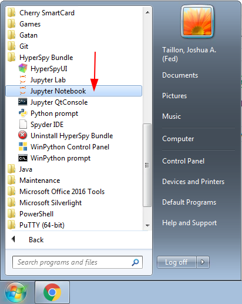

..
    Build this document with the command:

    ```
    python -m sphinx.cmd.build ./ ../ -n -E -a -j auto -b html
    ```

    from the ./instructions directory and commit the build files to the
    ``nist-pages`` branch to build the public site at
    https://pages.nist.gov/hyperspy_tutorial

    Make sure to use sphinx-bootstrap-theme 0.6.5 (0.7.1 has a problem with
    sidebar styling)

:tocdepth: 4

.. toctree::
   :hidden:

   install_bundle
   install_anaconda
   coming_soon

=================================
2021 M&M Sunday Short Course X-15
=================================

----------------------------------
Data Analysis in Materials Science
----------------------------------

Thank you for registering for the 2021 Microscopy and Microanalysis short course
on data analysis in materials science, presented by the developers of HyperSpy.
This interactive tutorial session will introduce you to modern techniques of
data analysis for materials science and microscopy data within the scientific
Python environment, with plenty of time for questions and individual help.
The ultimate goal for the session is that by its end, each attendee feels
comfortable using HyperSpy for basic imaging and hyperspectral data analysis,
and knows where to look for further help, if necessary.

There are a few useful links in the left sidebar of this page. The first (|tutorial_repo|)
will take you to the git repository containing the notebooks and data we will
use during the tutorial. The next (|launch_binder|) will open that 
repository in an interactive "Binder", which will allow you to run the tutorial
code in your browser without having to install anything (although we recommend
you take this opportunity to install HyperSpy on your local system -- see below). 
The next two point to the HyperSpy |hs_homepage| and |hs_userguide|,
respectively. The homepage contains general information about the project as
a whole, while the User Guide is an extensive piece of documentation that explains
how to use HyperSpy for all sorts of analyses. Feel free to refer
to these links before and during the tutorial session for additional help.

The sidebar on the right will help you navigate the content of *this* page, 
which has been set up to provide you with information about the course and 
some instructions to follow before you attend on Sunday. Please take the time
to read through the content and follow the instructions in advance of the 
course.

.. |tutorial_repo| raw:: html

   <a href="https://github.com/usnistgov/hyperspy_tutorial" target="_blank">Tutorial Repository</a>

.. |launch_binder| raw:: html

    <a href="https://mybinder.org/v2/gh/usnistgov/hyperspy_tutorial/2021-08-01_MandM_short_course" target="_blank">Launch Binder</a>

.. |hs_homepage| raw:: html

    <a href="http://hyperspy.org/" target="_blank">
        Homepage
    </a>

.. |hs_userguide| raw:: html

    <a href="http://hyperspy.org/hyperspy-doc/current/user_guide/intro.html" target="_blank">
        User Guide</a>

Session Logistics
-----------------

.. cssclass:: custom-table

    +--------------------+------------------------------------------------------------+
    | **Date:**          | | Sunday August 1, 2021                                    |
    +--------------------+------------------------------------------------------------+
    | **Time:**          | 10:30 AM - 5:45 PM EDT (UTC-04:00)                         |
    +--------------------+------------------------------------------------------------+
    | **Location:**      | | Virtual via web conferencing                             |
    |                    | | (Link will be sent via email to registered participants) |
    +--------------------+------------------------------------------------------------+

About the instructors
---------------------

.. cssclass:: instructor-table

    +----------+---------------------------------------------------------------------+
    | |hakon|  | | |hakon_link| (HA) is a PhD Candidate in the Department of         |
    |          |   Materials Science and Engineering at the Norwegian University of  |
    |          |   Science and Technology. He characterizes                          |
    |          |   recrystallization and texture in aluminum alloys by scanning and  |
    |          |   transmission electron microscopy. Prof. Knut Marthinsen is his    |
    |          |   main supervisor and Prof. Antonius T. J. van Helvoort is his      |
    |          |   co-supervisor. (Contact: hakon.w.anes@ntnu.no)                    |
    +----------+---------------------------------------------------------------------+
    | |carter| | | |carter_link| (CF) grew up in Prior Lake, Minnesota, a little     |
    |          |   south of the Twin Cities. He received his B.S. from the Iowa      |
    |          |   State University, majoring in Materials Engineering, minoring in  |
    |          |   Math Economics. There he worked on the characterization of both   |
    |          |   oxide and sulfide glasses for use as solid state electrolytes in  |
    |          |   sodium battery systems.  In the summer of 2016, Carter worked as  |
    |          |   a foreign scholar at the Münster Electrochemical Energy           |
    |          |   Technology (MEET) building in Münster Germany. There he worked    |
    |          |   characterizing and producing gel polymer electrolytes with        |
    |          |   ceramic inclusions. Carter is a graduate student at the           |
    |          |   University of Wisconsin-Madison working as a research assistant   |
    |          |   in Prof. Paul Voyles’ group. (Contact: csfrancis@wisc.edu)        |
    +----------+---------------------------------------------------------------------+
    | |eric|   | | |eric_link| (EP) is a Lecturer in Materials Characterisation at   |
    |          |   the University of Manchester and the SuperSTEM Laboratory. His    |
    |          |   main areas of research focus on the development, implementation   |
    |          |   and application of new TEM methodologies --- from specimen        |
    |          |   preparation, experimental workflow to advanced data processing    |
    |          |   and analysis --- with the aim to uncover the                      |
    |          |   structure-property relationships of materials. He is an open      |
    |          |   source enthusiast, and started to use the HyperSpy                |
    |          |   library as a user during his PhD and made his first code          |
    |          |   contribution during his Post-Doc. He has since increased his      |
    |          |   contribution and commitment to the development of HyperSpy        |
    |          |   and is now a core developer.                                      |
    |          |   (Contact: eric.prestat@manchester.ac.uk)                          |
    +----------+---------------------------------------------------------------------+
    | |josh|   | | |josh_link| (JT) is a research engineer within the Office         |
    |          |   of Data and Informatics in the Material Measurement               |
    |          |   Laboratory at NIST, and has an extensive                          |
    |          |   background in materials science, microscopy, and data analysis    |
    |          |   utilizing machine learning, artificial intelligence, and          |
    |          |   state-of-the art signal processing techniques to facilitate       |
    |          |   greater understanding of material systems. He is a (fairly)       |
    |          |   regular |contributor| to the upstream HyperSpy project and has    |
    |          |   been a user of the software for over 7 years.                     |
    |          |   (Contact: joshua.taillon@nist.gov)                                |
    +----------+---------------------------------------------------------------------+


.. |contributor| replace:: `contributor <https://github.com/hyperspy/hyperspy/commits?author=jat255>`__
.. |josh_link| replace:: `Josh Taillon <https://www.nist.gov/people/joshua-taillon>`__
.. |duncan_link| replace:: `Duncan Johnstone <https://www.emg.msm.cam.ac.uk/People/dnj23>`__
.. |kate_link| replace:: `Katherine MacArthur <http://www.er-c.org/metals/staff/macarthur.htm>`__
.. |magnus_link| replace:: `Magnus Nord <https://www.uantwerpen.be/en/staff/magnus-nord/>`__
.. |eric_link| replace:: `Eric Prestat <https://www.research.manchester.ac.uk/portal/en/researchers/eric-prestat(d6091419-ddb8-4164-9048-21fae9bb9074).html>`__
.. |carter_link| replace:: `Carter Francis <https://tem.msae.wisc.edu/group/carter-francis/>`__
.. |hakon_link| replace:: `Håkon Wiik Ånes <https://www.ntnu.edu/employees/hakon.w.anes>`__
.. |josh| image:: _static/josh_taillon.jpg
   :width: 100%
.. .. |kate| image:: _static/kate_macarthur.jpg
..    :width: 100%
.. .. |magnus| image:: _static/magnus_nord.png
..    :width: 100%
.. .. |duncan| image:: _static/duncan_johnstone.jpg
..    :width: 100%

.. |carter| image:: _static/carter_francis.jpg
   :width: 100%


Agenda
------

..  rst-class:: left-align-last-col
..  cssclass:: table-hover
..  table:: All times given in EDT (UTC-04:00)
    :widths: 30 20 20 70

    +-------------------+------------+-----------+----------------------------------------------------------------+
    | Time              | Format     | Leader(s) | Topic                                                          |
    +===================+============+===========+================================================================+
    | 09:30 - 10:30     | Help       | All       | Pre-course help for installation problems (1 hour)             |
    +-------------------+------------+-----------+----------------------------------------------------------------+
    | 10:30 - 10:35     | Talk       | JT        | Welcome and Announcements (5 minutes)                          |
    +-------------------+------------+-----------+----------------------------------------------------------------+
    | 10:35 - 11:00     | Talk       | JT        | Introduction to Scientific Python and HyperSpy (25 minutes)    |
    +-------------------+------------+-----------+----------------------------------------------------------------+
    | 11:00 - 11:30     | Practical  | EP        | HyperSpy Basics (30 minutes)                                   |
    +-------------------+------------+-----------+----------------------------------------------------------------+
    | 11:30 - 11:45     |            |           | *Break* (15 minutes)                                           |
    +-------------------+------------+-----------+----------------------------------------------------------------+
    | 11:45 - 12:30     | Practical  | JT        | Machine Learning (45 minutes)                                  |
    +-------------------+------------+-----------+----------------------------------------------------------------+
    | 12:30 - 13:15     | Practical  | EP        | Model Fitting (45 minutes)                                     |
    +-------------------+------------+-----------+----------------------------------------------------------------+
    | 13:15 - 13:45     |            |           | *Break* (30 minutes)                                           |
    +-------------------+------------+-----------+----------------------------------------------------------------+
    | 13:45 - 14:30     | Practical  | EP        | EELS analysis (45 minutes)                                     |
    +-------------------+------------+-----------+----------------------------------------------------------------+
    | 14:30 - 15:15     | Practical  | JT        | EDS Analysis (45 minutes)                                      |
    +-------------------+------------+-----------+----------------------------------------------------------------+
    | 15:15 - 16:00     | Practical  | EP        | Big Data Analysis (45 minutes)                                 |
    +-------------------+------------+-----------+----------------------------------------------------------------+
    | 16:00 - 16:15     |            |           | *Break* (15 minutes)                                           |
    +-------------------+------------+-----------+----------------------------------------------------------------+
    | 16:15 - 16:45     | Practical  | CF        | 4D STEM / Scanning Electron Diffraction (30 minutes)           |
    +-------------------+------------+-----------+----------------------------------------------------------------+
    | 16:45 - 17:15     | Practical  | HA        | Electron Backscatter Diffraction (EBSD) Analysis (30 minutes)  |
    +-------------------+------------+-----------+----------------------------------------------------------------+
    | 17:15 - 17:45     | Practical  | EP/JT     | Atomic Resolution STEM Analysis (30 minutes)                   |
    +-------------------+------------+-----------+----------------------------------------------------------------+

-------------------------
Pre-tutorial instructions
-------------------------

Please review this section in advance of Sunday's tutorial session, as it
includes instructions for installing HyperSpy and the Jupyter interactive
computing environment. 

..  admonition:: Installation alternative
    :class: seealso

    While we *highly* encourage you to follow the instructions below to 
    install HyperSpy locally on your personal system, you can run all the
    code that will be covered in the session in your browser via the 
    |launch_binder| link. The "Binder" is a web-based installation of 
    python that you can interact with through a normal web browser,
    without installing anything to your system. Completing the installation
    process is a useful learning experience however, and will be necessary if
    you wish to run your analyses on your own data after this course. There
    will be a one-hour "help session" prior to the official start of the 
    short course program during which you are welcome to ask questions/get help
    if you have any issues with the installation procedure.

Prerequisites
-------------

For participation in the session, a basic familiarity with Python and command
line tools will be helpful, but not strictly required. You will need to follow
the instructions below to install HyperSpy using either the Anaconda Python
distribution (Windows, Mac, or Linux), or the pre-compiled "bundle" installer
(only available on Windows).

Accessing the Slack Workspace
-----------------------------

During the session, we will be using Slack as a platform for interactive
communication between the instructors and students, as well as for students
to help answer each others' questions. While Slack can be used from a web 
browser, you may wish to install their desktop application in advance for a 
better experience. This can be done by visiting their |slack_download| page and 
following the instructions provided.

.. |slack_download| raw:: html

    <a href="https://slack.com/downloads/" target="_blank">
        Downloads</a>

Since this website is public, the link to the Slack Workspace will not be 
provided here. It will be sent via email closer to the date of the workshop,
so please check your email for information on how to join the Slack Workspace
for the course.

Installation
------------

At its core, HyperSpy is a third-party library that exists as part of the
greater scientific Python ecosystem (as opposed to a stand-alone application).
Because of this, installation is slightly different than a normal program,
but is not too difficult once you understand the steps required. The two pieces
required are a Python distribution (typically pre-installed on Mac and Linux;
but not included on by default on Windows), and then the HyperSpy libraries
that operate within that Python environment.

There are two possible approaches to getting a working HyperSpy environment. If
you are brand-new to Python and the command line in general, we recommend using
the pre-packaged :doc:`"Bundle" Installer <../install_bundle>`.

If you have some experience with Python, or if you expect to have multiple
versions or environments of Python on your system, we recommend you install 
HyperSpy using :doc:`Anaconda <../install_anaconda>`, due to its prevalence in 
the scientific community and the ease of managing multiple Python "environments" on
one system. It also provides a uniform way of installing packages and managing
the system regardless of operating system, as well as up-to-date versions of
Python and library packages (often the "system" installation on Linux or Mac is
out of date). Anaconda can also be installed and run without administrative
privileges, meaning it can be used on remote systems easily regardless of
ownership.

Click one of the following buttons to view the specific installation
instructions for each method:

.. raw:: html

    <div class="links-container-grid">
        <a  class="container-link" style="grid-column: 1 / span 2;"
            href="install_bundle.html">
                Click here for the "bundle"<br/>installation instructions
        </a>
        <a  class="container-link" style="grid-column: 3 / span 2;"
            href="install_anaconda.html">
                Click here for Anaconda Python<br/>installation instructions
        </a>
    </div>


..  caution::
    It is important that you install HyperSpy using either the
    :doc:`"Bundle" Installer <../install_bundle>`, or through
    :doc:`Anaconda <../install_anaconda>` (*not both*!). Installing
    both can work, but will leave you with multiple Python installations on your
    system, and it will be very confusing to try to solve any issues that arise
    if you are not experienced with Python.

.. _getting-data:

Obtaining the tutorial data
---------------------------

.. `this <https://github.com/usnistgov/hyperspy_tutorial/archive/2019-MandM.zip>`_

Please click
`this <https://github.com/usnistgov/hyperspy_tutorial/releases/download/2019_MandM_X15/hyperspy_tutorial.zip>`_
link to download the tutorial notebooks and data as a ``.zip`` file
(or click the `big green button <#>`_ at the top of this page). Due to the inclusion
of some larger files, it is nearly 2.0 GB in size, so please ensure that you have
enough disk space and bandwidth for the download. Once downloaded,
extract the files into their own folder that is easily accessible. We recommend
a folder in your user's home directory named ``hyperspy_tutorial``
(i.e. ``C:\Users\<username>\hyperspy_tutorial`` on Windows).

.. note::
   If you have limited disk space and/or internet availability, you can download
   a smaller version of the same data
   `here <https://github.com/usnistgov/hyperspy_tutorial/releases/download/2019_MandM_X15/hyperspy_tutorial_no_big_data.zip>`_.
   This archive is missing three large datasets, and so you will not be able to
   interactively participate in the *Big Data* and *pyXem* sessions. The
   remaining files are all the same.


Running the Jupyter Notebooks
-----------------------------

To actually open the Jupyter Notebooks containing the tutorials, you will need
to start a local Jupyter server and connect to it through your browser (don't
worry, everything stays local and there's no security risk to running the
notebook on ``localhost``).

If you installed using the bundle, this is very simple. Just open the Start Menu
and search for the "Miniforge Prompt" option:



   Starting the Miniforge Prompt from the Start Menu shortcut installed in the
   bundle

Once this prompt opens, enter the text ``jupyter notebook`` and press "Enter".
After a short time, your web-browser should open automatically to the notebook
server that was started. Make sure to leave the Miniforge Prompt window open
while you work, as closing it will shutdown the notebook server, and you will
not be able to run any of the code.

.. figure:: _static/bundle_starting_the_notebook.png
   :width: 100 %
   :alt: Starting the Jupyter Notebook from the Miniforge Prompt
   :figwidth: 50%

   Starting the Jupyter Notebook from the Miniforge Prompt

If you installed with Anaconda, open the Anaconda Prompt (Windows) or a regular terminal
(macOS/Linux). From that prompt, use the ``cd`` command to change to the
directory that contains the tutorial notebooks and data that you downloaded
in the previous section. For example, if you saved the data into a folder named
``hyperspy_tutorial`` in your user folder, you would change to that folder with
one of the following commands:

..  code-block:: bash

    # For Windows:
    $ cd %USERPROFILE%\\hyperspy_tutorial

    # For macOS or Linux:
    $ cd ~/hyperspy_tutorial

Once in that folder, start the Jupyter Notebook server with the following
command:

..  code-block:: bash

    $ jupyter notebook

..  figure:: _static/anaconda_starting_jupyter.png
    :width: 100 %
    :alt: Starting the Jupyter Notebook on Windows
    :figwidth: 70%

    Starting the Jupyter Notebook from the ``hyperspy_tutorial`` folder on
    Windows

Regardless if you used the bundle or Anaconda, once you start the notebook "server",
it will automatically open a browser window (or new tab) to connect to the local server.
Make sure to leave the terminal window open in the background, as closing it will
shut down the notebook server. If everything has worked as expected, then you
will see a representation of the directory structure within ``hyperspy_tutorial``
on the Notebook homepage. If you do not, you can click through the file structure
displayed on the page to get to the correct folder:

..  figure:: _static/anaconda_creating_a_notebook.png
    :width: 100 %
    :alt: The notebook server home page
    :figwidth: 70%

    Click a folder name to browse into that folder, or a notebook name to open
    that file

..  figure:: _static/opening_getting_started_folder.png
    :width: 100 %
    :alt: Navigating to a folder
    :figwidth: 70%

    (For example) click the "02 HyperSpy basics" link to browse into that folder

Once inside one of the folders, simply click on any file with the extension
``.ipynb`` to open the notebook. The notebook will open in a new tab, and can
be interacted with as you need:


..  figure:: _static/opening_getting_started.png
    :width: 100 %
    :alt: Opening a notebook
    :figwidth: 70%

    Opening the "Getting Started" notebook within the "02 HyperSpy basics"
    folder

The original Jupyter "homepage" will stay open in the first tab, and you can
open as many notebooks as you wish at once (as long as you leave the terminal
window open in the background).

Congratulations! You should now be ready for the tutorial. If you ran into any
trouble, please try to arrive on Sunday morning a bit early, and one of the
instructors will be happy to help get you up and running.

------------
Getting Help
------------

In addition to the links in the header of this page, there are a few additional
resources that can be used to get help with questions you may have about using
the software. The `support <http://hyperspy.org/support.html>`_ page for the
project highlights the best avenues for help, but briefly they are:

- The HyperSpy `User Guide <http://hyperspy.org/hyperspy-doc/current/index.html>`_
- The HyperSpy `user mailing list <https://groups.google.com/forum/#!forum/hyperspy-users>`_
- The interactive `Gitter chat room <https://gitter.im/hyperspy/hyperspy>`_
- The `issue/bug tracker <https://github.com/hyperspy/hyperspy/issues>`_ on the HyperSpy Github page
- The `HyperSpy Demos <https://github.com/hyperspy/hyperspy-demos/>`_ repository, which contains the foundations of the notebooks presented in this tutorial, together with some additional demos

Also, we will be having an open "office hours" session for one hour prior to 
the start of Sunday's course. If you have any problems getting things installed,
we will use this time for interactive debugging of issues so you can be ready
for the course. Please do attempt to install and test your installation before
arriving however, as we will not have time to walk every person through every
step.

----------
Disclaimer
----------


Any mention of commercial products is for information only; it does not imply recommendation or endorsement by NIST or the U.S. Government.

NIST-developed software is provided by NIST as a public service. You may use, copy and distribute copies of the software in any medium, provided that you keep intact this entire notice. You may improve, modify and create derivative works of the software or any portion of the software, and you may copy and distribute such modifications or works. Modified works should carry a notice stating that you changed the software and should note the date and nature of any such change. Please explicitly acknowledge the National Institute of Standards and Technology as the source of the software.

NIST-developed software is expressly provided "AS IS." NIST MAKES NO WARRANTY OF ANY KIND, EXPRESS, IMPLIED, IN FACT OR ARISING BY OPERATION OF LAW, INCLUDING, WITHOUT LIMITATION, THE IMPLIED WARRANTY OF MERCHANTABILITY, FITNESS FOR A PARTICULAR PURPOSE, NON-INFRINGEMENT AND DATA ACCURACY. NIST NEITHER REPRESENTS NOR WARRANTS THAT THE OPERATION OF THE SOFTWARE WILL BE UNINTERRUPTED OR ERROR-FREE, OR THAT ANY DEFECTS WILL BE CORRECTED. NIST DOES NOT WARRANT OR MAKE ANY REPRESENTATIONS REGARDING THE USE OF THE SOFTWARE OR THE RESULTS THEREOF, INCLUDING BUT NOT LIMITED TO THE CORRECTNESS, ACCURACY, RELIABILITY, OR USEFULNESS OF THE SOFTWARE.

You are solely responsible for determining the appropriateness of using and distributing the software and you assume all risks associated with its use, including but not limited to the risks and costs of program errors, compliance with applicable laws, damage to or loss of data, programs or equipment, and the unavailability or interruption of operation. This software is not intended to be used in any situation where a failure could cause risk of injury or damage to property. The software developed by NIST employees is not subject to copyright protection within the United States.
