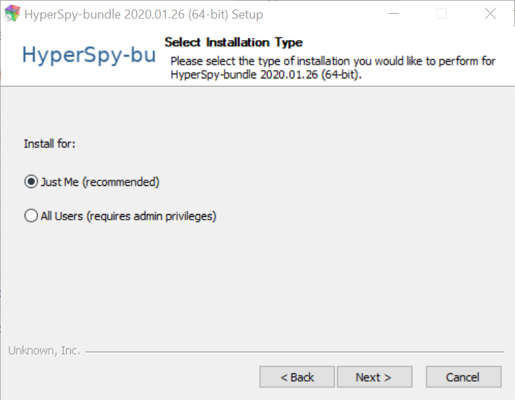
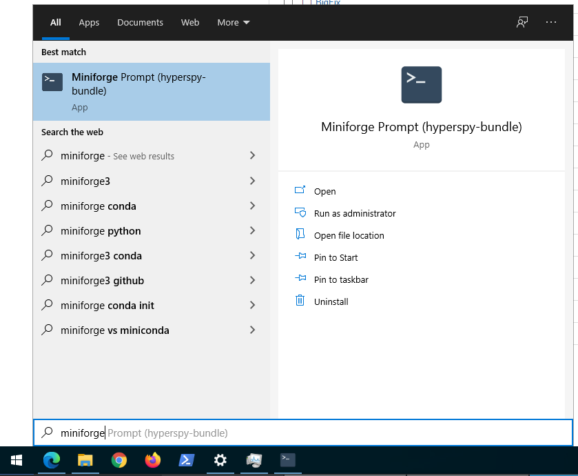

.. _bundle_mac-label:

Installing via the "Bundle"
~~~~~~~~~~~~~~~~~~~~~~~~~~~

If you are running on Windows, the easiest way to install HyperSpy is using
the "standalone" bundle package. This simple to install program provides a
customized Anaconda installation that has the HyperSpy libraries pre-installed.
A detailed walk through of the process is provided below.

Download
^^^^^^^^

First, download the installer using the following link
(https://github.com/ericpre/hyperspy-bundle/releases):

.. figure:: _static/github_download_labels.png
   :width: 100 %
   :target: https://github.com/hyperspy/hyperspy-bundle/releases
   :alt: Links HyperSpy bundle downloads
   :figwidth: 70%

   Download the installer corresponding to your system.

Installing
^^^^^^^^^^

Run the downloaded file to proceed with the installation. This process is fairly
straightforward. For the installation location, we *highly* recommend to install
as single user in a folder that does not require administrative rights, as set 
by default.

   Single user installation is recommended.

Keep the default options unless you know what you are doing.

.. figure:: _static/bundle_defaults_option.png
   :width: 100 %
   :alt: Bundle installation progress
   :figwidth: 50%

   A screenshot showing the default options.

And that's it! All the installed programs should now be available within the
Start Menu under the "HyperSpy Bundle" folder. You can either continue following
the next section to test the installation, or continue to the
:ref:`getting-data` section on the main page.

Testing the installation
^^^^^^^^^^^^^^^^^^^^^^^^

If you would like to test that your installation is working properly, you can
run a small test example by opening the "Qt Console". This is an interactive
Python interpreter that allows you to type in Python statements directly. Launch
the Qt Console from within the "HyperSpy Bundle" folder in the Start Menu:

   Launching the interactive Python console from the Start Menu

.. include:: testing_install.rst
