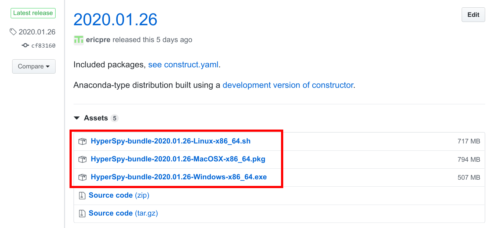
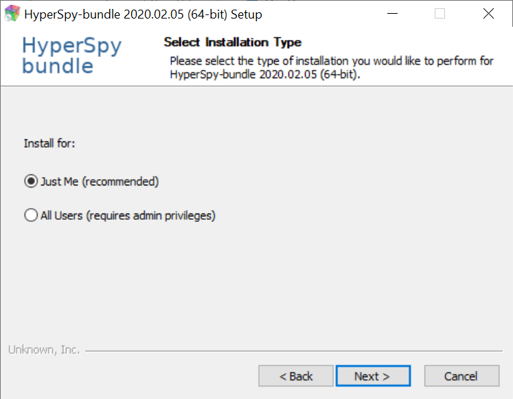
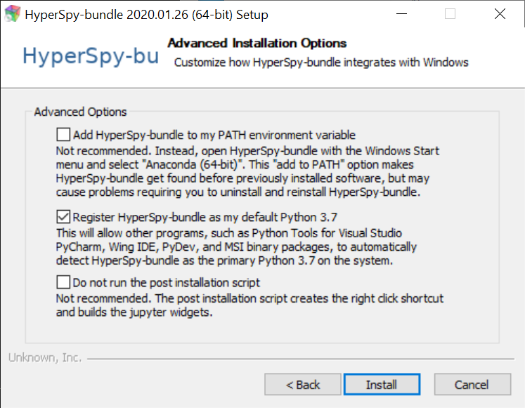

.. _bundle_windows-label:

Installing on Windows
---------------------

On Windows, the easiest way to install HyperSpy is to use the HyperSpy bundle
installer. This simple to install program provides a customized Anaconda 
installation, which contains the HyperSpy libraries but also other libraries 
used in the field of electron microsocpy. A detailed walk through of the 
process is provided below.

Download
^^^^^^^^

First, download the installer using the following link
(https://github.com/ericpre/hyperspy-bundle/releases):

   Download the installer corresponding to your system.

Installing
^^^^^^^^^^

Run the downloaded file to proceed with the installation. This process is fairly
straightforward. For the installation location, we *highly* recommend to install
as single user in a folder that does not require administrative rights, as set 
by default.

   Single user installation is recommended.

Keep the default options unless you know what you are doing.

   A screenshot showing the default options.

Doing so will install HyperSpy into your user folder under a subfolder named
``"Anaconda (64 bits)"``. The installation may take some time, but you should get
a progress window that looks like:

And that's it! All the installed programs should now be available within the
Start Menu under the "HyperSpy Bundle" folder. You can either continue following
the next section to test the installation, or continue to the
:ref:`getting-data` section on the main page.

.. _test_install_label:

.. include:: testing_install.rst
